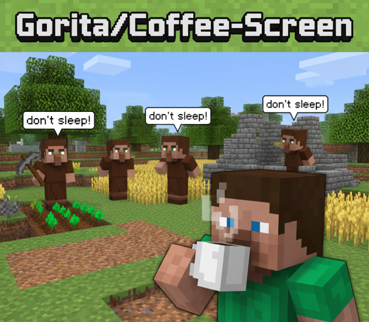

# Coffee-Screen

<p align="center">
  
</p>

> 가벼운 macOS용 장기 실행 프로세스 보장 및 화면 보안 애플리케이션

**[English README](README.md)**

## 소개

Coffee-Screen은 AI 학습, 대용량 데이터 렌더링 등 장시간 작업을 수행할 때 **시스템 수면을 방지**하고, **화면을 가려** 작업 내용을 보호하는 macOS 애플리케이션입니다.

기업 보안 환경(MDM, DLP, 백신 등)에서도 안전하게 동작하도록 설계되었습니다.

## 주요 기능

- **시스템 수면 방지**: IOKit Power Assertion으로 CPU, 네트워크 활성 상태 유지
- **화면 은폐**: 모든 모니터를 검은 윈도우로 덮어 작업 내용 보호
- **입력 차단**: Kiosk Mode API로 Cmd+Tab, 강제 종료 등 시스템 이탈 방지
- **안전한 잠금 해제**: Touch ID, 비밀번호 또는 PIN으로 인증
- **상태바 메뉴**: 메뉴바에서 빠르게 잠금/해제 및 설정 접근

## 왜 가벼운가?

- **외부 의존성 제로** - 네이티브 macOS 프레임워크만 사용 (SwiftUI, AppKit, IOKit)
- **작은 코드베이스** - ~2,500줄, Swift 파일 21개
- **최소 리소스 사용** - 런타임에 power assertion 하나와 윈도우 몇 개만 사용

## 시스템 요구사항

- macOS 14 (Sonoma) 이상
- Apple Silicon 또는 Intel Mac

## 설치

### Direct Download
[Releases](https://github.com/Gorita/Coffee-Screen/releases) 페이지에서 최신 DMG를 다운로드하세요.

> **참고**: 서명되지 않은 앱입니다. 처음 실행 시 앱을 우클릭 → "열기"를 선택하세요.

### 빌드
```bash
git clone https://github.com/Gorita/Coffee-Screen.git
cd Coffee-Screen

# 빠른 릴리스 (빌드 + DMG 생성)
./scripts/release.sh

# 또는 Xcode에서 열기
open CoffeeScreen.xcodeproj
```

## 사용법

1. 앱을 실행합니다.
2. **PIN을 설정**합니다 (4-8자리 숫자, 최초 1회 필수).
3. **"화면 잠금"** 버튼을 클릭합니다.
4. 화면이 검게 덮이고 시스템 수면이 방지됩니다.
5. 잠금 해제: 화면을 클릭하고 **Touch ID**, **비밀번호** 또는 **PIN**으로 인증합니다.

## 비상 탈출

키오스크 모드에서 앱이 멈추거나 인증이 실패할 경우:
- **양쪽 Shift + Cmd + L** 키를 동시에 눌러 즉시 잠금 해제 (기본값)
- 비상 탈출 키는 설정에서 변경 가능합니다

## 주의사항

- 전원 어댑터 연결을 권장합니다 (배터리 모드에서 덮개 닫을 시 절전 진입 가능)
- 물리적 전원 버튼 강제 종료는 막을 수 없습니다

## 라이선스

MIT License

## 문서

- [기술 스택](docs/TECH_STACK.md)
- [아키텍처](docs/ARCHITECTURE.md)
- [구현 계획](docs/IMPLEMENTATION_PLAN.md)
- [배포 가이드](docs/DEPLOYMENT.md)
