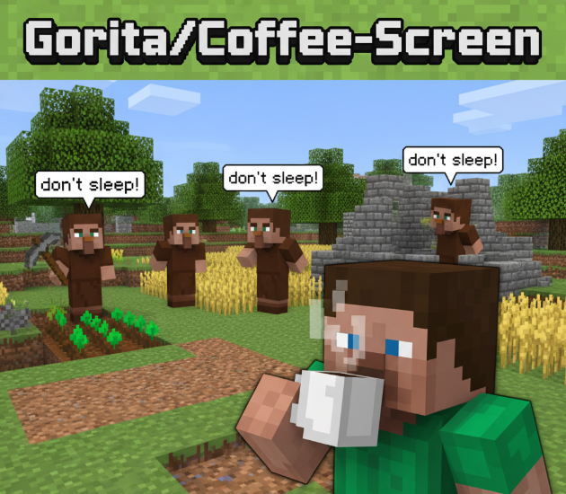

# Coffee-Screen ☕

<p align="center">
  
</p>

<p align="center">
  <strong>장시간 작업 프로세스 보호, 감각적인 잠금화면 커스터마이징 및 화면 보안을 위한 가벼운 레트로 스타일 macOS 애플리케이션</strong>
</p>

<p align="center">
  
  
  
  
</p>

---

**[🇺🇸 View English README](README.md)**

## 🌟 소개

**Coffee-Screen**은 AI 모델 학습, 4K 동영상 렌더링, 대규모 프로젝트 컴파일 등 장시간 작업을 수행할 때 **Mac이 잠들지 않도록(Keep-Awake)** 방지하고, 자리를 비울 때 중요한 작업 화면을 **완벽하게 가려주는(Screen Concealment)** 보안 앱입니다.

여기에 레트로 8-bit 감성의 **잠금화면 스티커 비주얼 스튜디오**와 **30초 롱 시네마틱 락스크린 애니메이션**을 더했습니다.

기업 보안 환경(MDM, DLP, 백신 등)에서도 충돌 없이 안전하게 동작하도록 네이티브 코드로 경량화 설계되었습니다.

---

## ✨ 주요 기능

### 🛡️ 수면 방지 및 화면 보안
- **시스템 수면 방지**: `IOKit` 네이티브 Power Assertion을 통해 CPU, GPU, 네트워크 연결 상태를 100% 유지합니다.
- **단독 깨우기 모드 (Awake Mode)**: 화면을 잠그지 않고 Mac을 정상 사용하면서 절전만 방지합니다 (메뉴바/메인 원클릭 토글).
- **다중 모니터 완벽 은폐**: 연결된 모든 모니터를 덮어 자리를 비운 사이 화면 노출을 차단합니다.
- **키오스크 입력 방패**: 잠금 중 `Cmd+Tab`, Mission Control, 강제 종료 단축키, 핫코너 등의 시스템 이탈 입력을 완벽히 차단합니다.
- **간편하고 안전한 인증 해제**: **Touch ID**, **macOS 사용자 비밀번호**, **4~8자리 커스텀 PIN**을 지원합니다.
- **비상 탈출 단축키**: 예기치 않은 시스템 먹통 시 **양쪽 Shift + Cmd + L**로 즉시 잠금을 해제할 수 있습니다.

### 🎨 잠금화면 에디터 스튜디오 (`Edit Lock Screen`)
- **실시간 비주얼 캔버스**: 락스크린 배경과 스티커를 직접 꾸미고 미리 보는 인터랙티브 에디터.
- **Apple Vision AI 배경 누끼 자동 제거**: 스티커 이미지를 끌어다 놓으면 온디바이스 AI가 배경을 자동으로 깔끔하게 투명화합니다.
- **캔버스 컨트롤**: 8-bit 스타일의 레트로 핸들로 스티커 이동, 크기 조절, 회전, 레이어 순서 변경 지원.

### 🎬 30초 롱 시네마틱 HD 락스크린 GIF 프리셋 5종 기본 탑재
1280×720 HD 해상도의 30초 무한 루프 시네마틱 프리셋:
1. **Interactive Typing**: 실시간 개발자 터미널 명령어 타이핑, 컴파일 로그 스트리밍, 42개 유닛 테스트 통과, 실시간 CPU/RAM 부하 대시보드가 이어지는 Seamless 루프.
2. **Pixel Dog**: 터미널 코드 통로를 걷고, 커서를 앞발로 톡톡 치고, 모락모락 에스프레소 냄새를 맡으며 하트 점프 후 웅크려 자는 1줄 크기의 터미널 컴패니언 시바견.
3. **Dev Terminal**: 30초 동안 흐르는 C++/Swift 커널 소스코드 디스플레이.
4. **Ghostty ASCII**: 빛나는 감성 레트로 아스키 터미널.
5. **Summer Horror**: 서늘한 분위기의 납량특집 공포 테마.

### ☕ Buy Me a Coffee 후원 모달
- 하프톤(Halftone) 알고리즘으로 렌더링된 **커피잔 & 모락모락 연기 애니메이션 QR 코드** 팝업 (바깥 영역 클릭 시 닫기 지원).

### 🔄 Sparkle 2 자동 업데이트
- 별도 수동 재설치 없이 앱 내에서 원클릭으로 최신 릴리스 자동 업데이트.

---

## 💻 시스템 요구사항

- **운영체제**: macOS 14.0 (Sonoma) 이상
- **지원 아키텍처**: Universal (Apple Silicon M1/M2/M3/M4 & Intel 64-bit)

---

## 🚀 설치 및 빌드

### 직접 다운로드
[Releases](https://github.com/Gorita/Coffee-Screen/releases) 페이지에서 최신 `.dmg` 파일을 다운로드하여 실행하세요.

> **Gatekeeper 안내**: 독립 개발자 빌드로, 첫 실행 시 앱을 **우클릭 ➡️ "열기"**를 선택해 주세요.

### 소스코드 빌드
```bash
# 레포지토리 클론
git clone https://github.com/Gorita/Coffee-Screen.git
cd Coffee-Screen

# 배포용 Release DMG 생성
./scripts/release.sh

# 또는 Xcode에서 열기
open CoffeeScreen.xcodeproj
```

---

## 📖 사용 방법

### 1. 화면 잠금 모드
1. **Coffee-Screen** 앱을 실행합니다.
2. 최초 실행 시 4~8자리 PIN을 설정합니다.
3. **"Lock Screen"** 버튼을 클릭합니다 (또는 잠금 단축키 사용).
4. 화면이 보호되며, 복귀 시 **Touch ID**, **비밀번호** 또는 **PIN**으로 인증하여 해제합니다.

### 2. 깨우기 모드 (Awake Mode)
1. 메인 화면의 커피잔 버튼을 토글하거나 메뉴바에서 **"Keep Mac Awake"**를 클릭합니다.
2. 화면 잠금 없이 Mac을 정상적으로 사용하면서 절전만 방지됩니다.

### 3. 잠금화면 커스터마이징
1. 메뉴바 아이콘 클릭 ➡️ **"Edit Lock Screen"** 선택.
2. 기본 탑재된 5가지 30초 HD 프리셋을 고르거나, 나만의 이미지/움직이는 GIF 배경을 등록합니다.
3. 원하는 스티커를 올려 Vision AI 누끼 제거로 나만의 락스크린을 완성하고 **"Save Changes"**를 누릅니다.

---

## 📄 라이선스

이 프로젝트는 **MIT 라이선스**를 따릅니다. 자세한 내용은 `LICENSE` 파일을 참고하세요.
